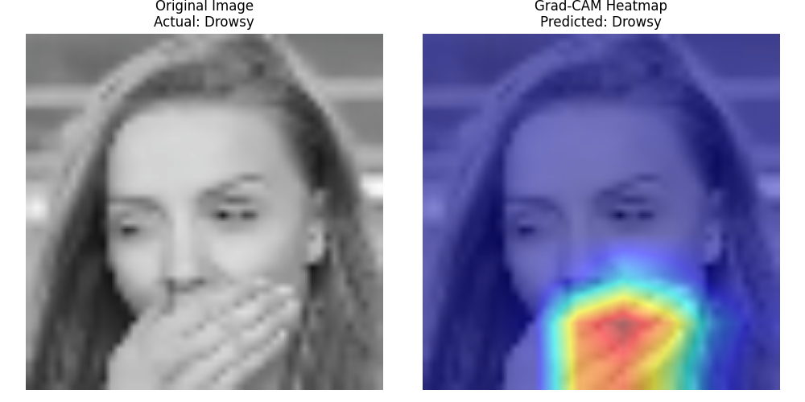
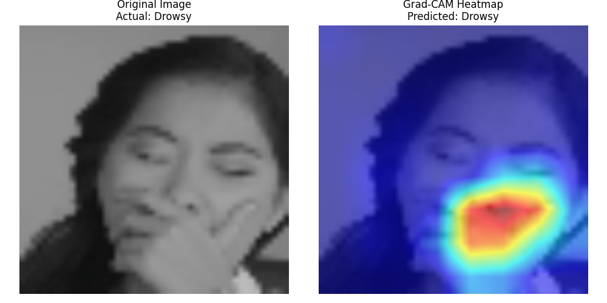
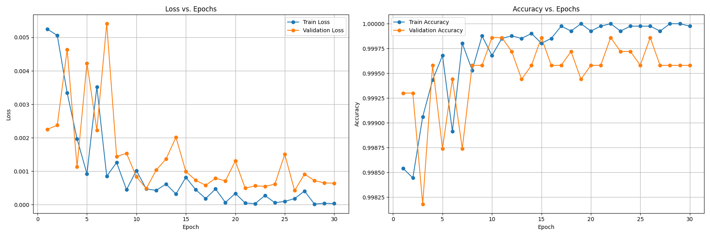
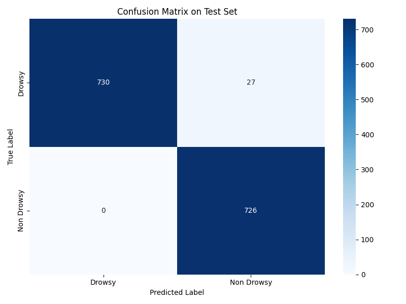

## MobileViT v2 for Driver Drowsiness Detection

This repository contains a complete, end-to-end pipeline for training a state-of-the-art MobileViT v2 model to detect driver drowsiness from images. The project covers every stage of the machine learning lifecycle, from automated data acquisition and cleaning to robust model evaluation and explainability.


## 1. Project Highlights

State-of-the-Art Model: Utilizes the powerful and efficient mobilevitv2_200 architecture, a hybrid of MobileNet convolutions and Vision Transformers, fine-tuned for a binary classification task.

End-to-End Workflow: The entire process is encapsulated in a single, reproducible Jupyter Notebook (MobileViT_Drowsiness.ipynb).

Robust Data Handling: Features automated dataset downloading from Kaggle, a rigorous data cleaning script to remove corrupted or invalid images, and a strict separation of training, validation, and testing data to prevent leakage.

Advanced Evaluation: Uses domain-specific metrics: APCER, BPCER, and ACER for evaluation.

Model Explainability: Uses Grad-CAM to produce heatmaps, visualizing the image regions the model focuses on to make its predictions and ensuring it learns relevant features.

Model in Action: 
Grad-CAM Explainability
The model correctly focuses on key facial features like eyes, mouth, and head position to determine the driver's state.



	




## 2. Project Workflow

The project follows a structured machine learning pipeline:

- Environment Setup: Installation of all required libraries and configuration of the environment.

- Data Acquisition: Datasets are automatically downloaded from Kaggle using the kagglehub library.

- Data Preparation: Images are organized into train, val, and test directories. The test set is sourced from a completely different dataset to ensure unbiased evaluation.

- Data Cleaning: A multiprocessing script scans all images for corruption, incorrect dimensions, and low variance, ensuring data quality.

- Training: A pre-trained MobileViT v2 model is fine-tuned using best practices like data augmentation, a learning rate scheduler, and early stopping to prevent overfitting.

- Evaluation & Analysis: The model's performance is measured on the unseen test set using both standard and specialized metrics.

- Explainability: Grad-CAM is used to interpret the model's predictions visually.


## 3. Repository Structure

```
.
│   MobileViT_Drowsiness.ipynb      # The main notebook containing the full pipeline
│   problematic_images.log          # Log file of corrupted/removed images
│   README.md                       # This README file
│
├───models/
│       best_model.pt               # Saved weights of the best performing model
│
├───visualizations/
│        augmentation_grid_*.png     # Examples of data augmentation
│        confusion_matrix_plot.png   # Confusion matrix on the test set
│        dataset_visualization_grid.png # A sample grid of dataset images
│        grad_cam_sample_*.png       # Grad-CAM explainability outputs
│        training_history.csv        # CSV log of training/validation metrics per epoch
│        training_plot.png           # Plot of accuracy and loss curves
│
└───.ipynb_checkpoints/
    MobileViT_Drowsiness-checkpoint.ipynb   # The notebook from a previous proof of concept test
```

**Execution:**
- Open and run the cells in MobileViT_Drowsiness.ipynb sequentially. The notebook will automatically download the datasets, process the data, train the model, and generate all evaluation plots and artifacts in the visualizations/ and models/ directories.


## 4. Evaluation and Results

The model achieves excellent performance on the unseen test set, demonstrating strong generalization.

Metric	Score
Accuracy	98.18%
APCER (Drowsy classified as Non-Drowsy)	3.57%
BPCER (Non-Drowsy classified as Drowsy)	0.00%
ACER (Average Classification Error Rate)	1.78%

APCER is the most critical metric for this use case, as it represents the rate of dangerous misclassifications (failing to detect a drowsy driver). The model's low APCER is a strong indicator of its potential for safety applications.

The training and validation curves show stable learning with no signs of significant overfitting, thanks to early stopping.




The confusion matrix confirms the model's high precision and recall, with very few errors on the test set.




## 5. Future Work
- Retrain with more varied datasets to improve generalization for real world applications.
  
- Threshold Tuning: Analyze the model's ROC or DET curve to select an optimal classification threshold that further minimizes APCER for safety-critical deployment.

- In-the-Wild Testing: Evaluate the model on more challenging, real-world data featuring varied lighting conditions, occlusions (sunglasses), and different camera angles.

- Model Quantization: Explore model quantization (e.g., using ONNX Runtime or TFLite) to optimize for deployment on edge devices with limited computational resources.


## 6. Acknowledgements

This project uses the following datasets from Kaggle:
- Driver Drowsiness Dataset (DDD) by ISMAIL NASRI.
- Drowsy Detection Dataset by YASHAR JEBRAEILY.

## 7. License
This project is licensed under the MIT License. See the LICENSE file for details.
